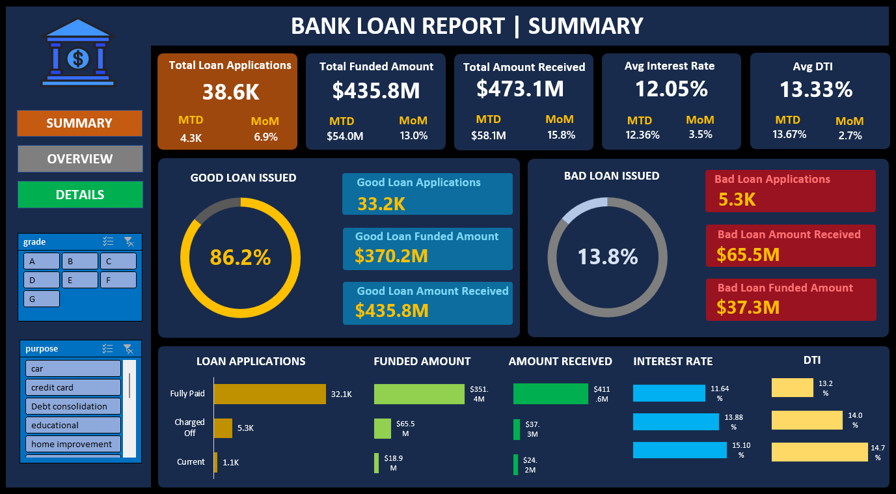

# 🏦 Bank Loan Analysis Dashboard

## 📌 About the Project
This project is an interactive **Bank Loan Analysis Dashboard** built using **Microsoft Excel** to analyze lending performance and loan portfolio health.

The dashboard helps stakeholders understand **how loans are performing**, **which customers are risky**, and **where business decisions can be improved** using data-driven insights.

---

## 🎯 Business Problem
Banks deal with thousands of loan applications every month.  
Without proper analysis, it becomes difficult to:
- Track loan growth
- Identify risky (bad) loans
- Monitor interest rates and customer debt burden
- Understand regional and customer behavior

This project solves that problem by converting raw loan data into **clear visual dashboards**.

---

## 📊 Dashboards Overview

### 🔹 Summary Dashboard
Provides a high-level snapshot of the loan portfolio:
- Total Loan Applications (MTD & MoM)
- Total Funded Amount
- Total Amount Received
- Average Interest Rate
- Average Debt-to-Income (DTI)
- Good Loans vs Bad Loans comparison

This dashboard is designed for **senior management** and quick decision-making.

---

### 🔹 Overview Dashboard
Gives deeper analytical insights:
- Monthly loan application trends
- State-wise loan distribution
- Loan term analysis (36 vs 60 months)
- Employment length impact on loans
- Loan purpose analysis
- Home ownership distribution

This dashboard supports **business analysts and MIS teams**.

---

## 🧮 Key KPIs Tracked
- Total Loan Applications
- Month-to-Date (MTD) & Month-over-Month (MoM) trends
- Total Funded Amount
- Total Amount Received
- Average Interest Rate
- Average Debt-to-Income Ratio (DTI)
- Good Loan vs Bad Loan percentages

---

## 📈 Key Insights
- Majority of loans fall under **Good Loan category**
- 36-month loans dominate the portfolio
- Customers with rent or mortgage apply more frequently
- Interest rate and DTI vary significantly by loan status
- Regional patterns highlight high-activity states

---

## 🛠 Tools & Skills Used
- Microsoft Excel
- Pivot Tables & Pivot Charts
- Dashboard Design
- Data Cleaning & Analysis
- Business KPI Analysis

---

## 🚀 How to Use This Project
1. Download or clone the repository
2. Open `Dashboard.xlsx`
3. Use slicers and filters (Grade, Purpose, etc.)
4. Explore insights across dashboards

---

## 👤 Author
**Amit Das**  
Aspiring Data Analyst | Excel | Data Visualization | Business Insights

