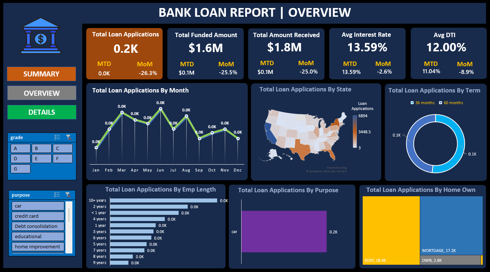

# Bank Loan Analysis Dashboard

## Project Overview
This project presents a Bank Loan Analysis Dashboard created using Excel.
It helps analyze loan applications, funded amount, interest rate, DTI,
and loan performance (Good vs Bad loans).

## Dashboards Included

### Summary Dashboard
- Total Loan Applications
- Total Funded Amount
- Total Amount Received
- Average Interest Rate
- Average DTI
- Good Loan vs Bad Loan Analysis

### Overview Dashboard
- Monthly Loan Trends
- State-wise Loan Distribution
- Loan Term Analysis
- Employment Length Analysis
- Loan Purpose Analysis
- Home Ownership Analysis

## Tools Used
- Microsoft Excel
- Pivot Tables
- Charts & Dashboards

## How to Use
1. Download the project
2. Open Dashboard.xlsx
3. Use filters to explore insights

## Author
Amit Das
